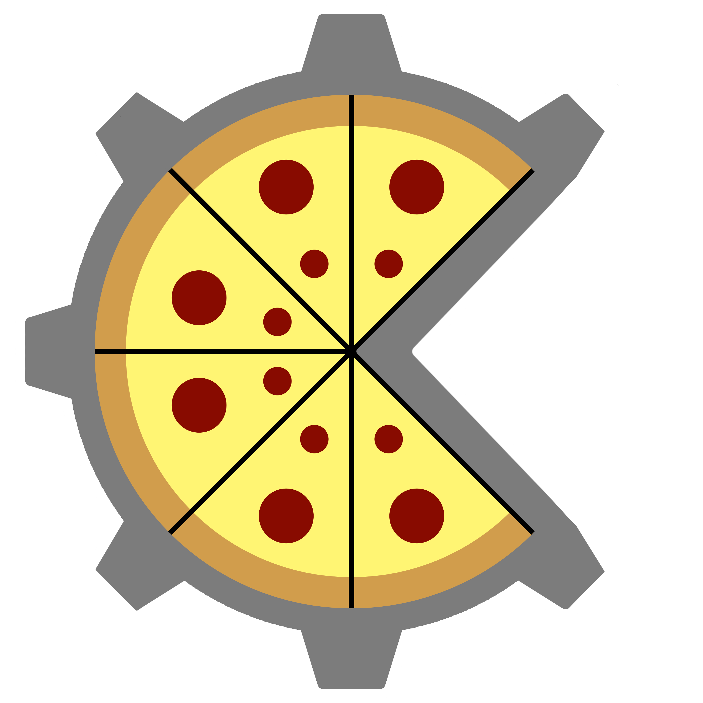

# Build Chef

### About
Build chef is a C++ build tool focussed on simplicity and ease of use.

### Compiling
Build chef is written entirely in Golang with no dependencies. Simply run the go build command from the root of the project:

`go build`

### Usage

Use the `-h` flag for usage details.

Recipe files themselves are very intuitive. View the samples files under `samples` for format and usage details. Run `bchef review -path samples` to inspect how the samples are parsed.
